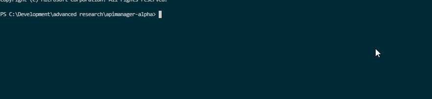

# React-Off-The-Grid
Unopinionated component that stores your store (redux or otherwise) in local storage.



## Usage

create the store and provide an instance of it to the component

```jsx

 <OfflineMode saveName="MOOSE_FILE" store={ store } />
```

typical example:

```jsx

const store = createStore(reducers);
ReactDOM.render(
  <div>
    <OfflineMode saveName="MOOSE_FILE" store={ store } />
    <Provider store={ store }>
      <App/>
   </Provider>
  </div>, document.getElementById('root'));
```

Thats it, your application will now save to local storage whenever the redux store changes

### props

`saveName` - The name of the save file in local storage<br/>
`store` - the redux store<br/>
`comparisonFunction` - If the baked in shallow comparison function doesn't do it for you (compares by simple type and references), you can provide your own as a prop, it must return a true or false, which is then used to determine if the component should save the current store state<br/>

### What it does
The offline mode component subscribes to the store provided to it when the store changes the offline mode component will receive the new state and store it in localstorage. This means that anytime the store state changes localstorage will save those changes.

The offline mode component will attempt to load from localstorage if the provided store is empty. It will do this by checking the keys in the store to see if they have any values. If it discovers that the store is empty then it will look for a save file and dispatch an event with the same data as the payload
The name of the action is `LOAD_FROM_LOCAL_STORAGE.

When saving, offline mode will add the key `_lastModified` to the object for comparisons.

You do not have to use redux the store can be from any event handler provided that the store has a subscribe and dispatch function
